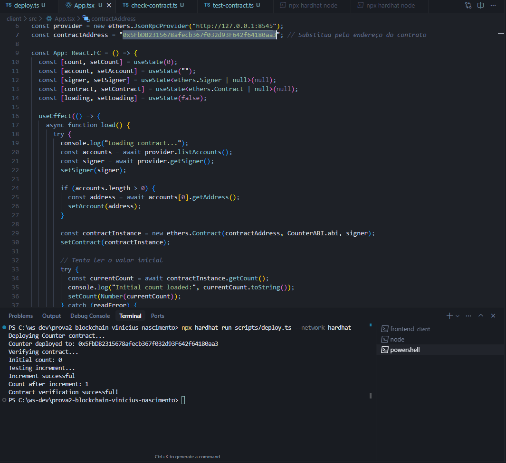

# Counter Blockchain DApp

Este projeto é um contador descentralizado (DApp) usando Solidity, Hardhat, React e Ethers.js, integrado com Ganache para testes locais.

## Como rodar o projeto
1. Instale as dependências:
   ```sh
   npm install
   cd client && npm install
   ```
2. Inicie o Ganache (porta 7545).
3. Compile e faça o deploy do contrato:
   ```sh
   npx hardhat compile
   npx hardhat run scripts/deploy.ts --network ganache
   ```
4. Atualize o endereço do contrato no frontend (`client/src/App.tsx`).
5. Rode o frontend:
   ```sh
   cd client
   npm start
   ```
6. Acesse `http://localhost:3000` no navegador.

## Funcionalidades
- Incrementar, decrementar e zerar o contador na blockchain
- Exibe o nome do autor cadastrado no contrato
- Mostra mensagem de parabéns ao atingir um número X de incrementos
- Integração completa com Ganache (blockchain local)

## Comprovação de funcionamento
Veja abaixo a imagem de comprovação do funcionamento da aplicação:



---

Projeto para fins didáticos e de demonstração.
